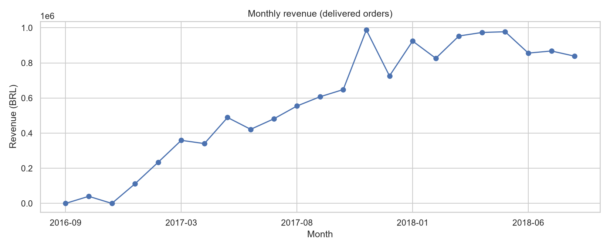
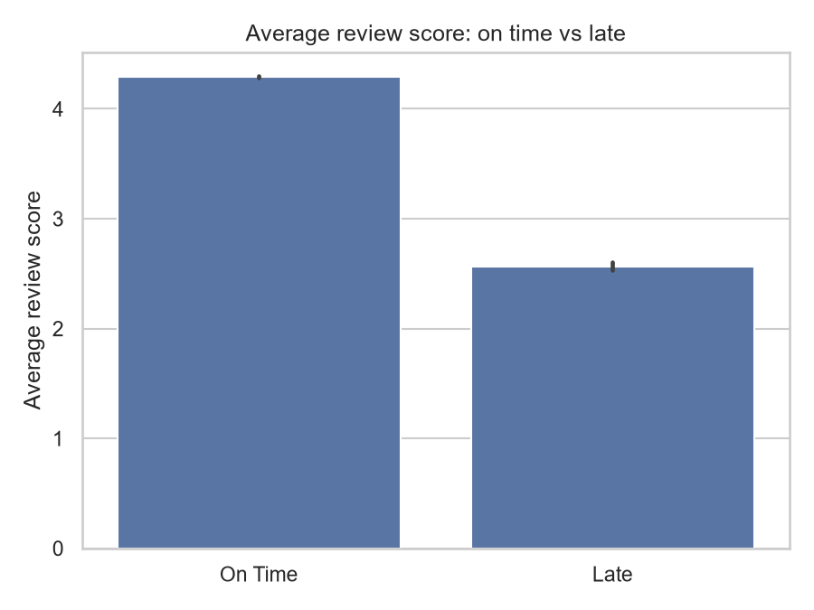
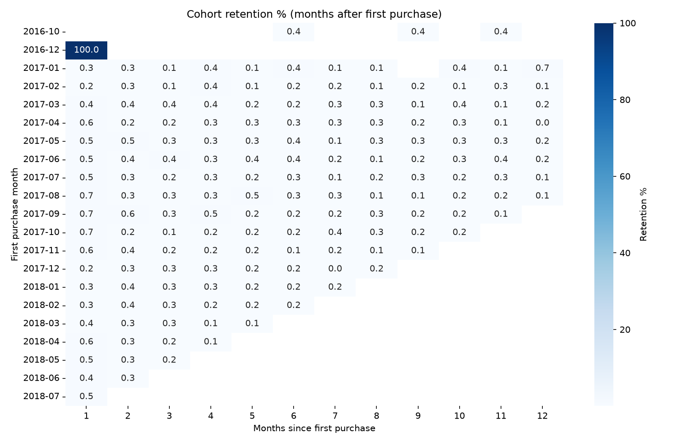

# E-Commerce Sales & Customer Analytics (Olist)

End-to-end analysis of 99K+ orders from Olist, a Brazilian e-commerce marketplace, using
**SQL (PostgreSQL, SQLite), Python, Excel and Tableau**.

**Live dashboard:** [Olist E-Commerce Sales & Delivery Dashboard (Tableau Public)](https://public.tableau.com/app/profile/vivek.prasad5963/viz/OlistE-CommerceSalesDeliveryDashboard/OlistE-CommerceSalesDeliveryDashboard)
**Power BI version:** [powerbi-sales-analytics](https://github.com/Vivek346282737/powerbi-sales-analytics)

## Business questions

1. Where does revenue come from, and how is it growing month over month?
2. Who are the most valuable customers, and how many come back?
3. Does late delivery reduce customer review scores?

## Key findings

- **Revenue:** BRL 13.2M from 96,478 delivered orders (average order value BRL 137). Three states
  (SP, RJ, MG) generate 63% of revenue. Top categories: health & beauty (9.3%), watches & gifts (8.8%),
  bed, bath & table (7.7%).
- **Customers:** only 3.0% of 93,358 customers ordered more than once; month-1 retention is 0.48%.
  The top 20% of customers account for 56.6% of revenue.
- **Delivery and reviews:** 8.1% of orders arrived late. Late orders average a 2.57 review score versus
  4.29 for on-time orders (Welch t-test and Mann-Whitney U, p < 0.001). In a linear regression, a late
  delivery lowers the review score by 1.22 points after controlling for delivery time, order value,
  freight and item count.

| Monthly revenue | Review score: on time vs late |
|---|---|
|  |  |



## Recommendations

1. **Fix late delivery first.** It is the strongest driver of bad reviews. Set realistic delivery estimates
   for northern and north-eastern states and review the sellers with the highest late rates.
2. **Build a repeat-purchase programme.** With 97% one-time buyers, a follow-up offer in the first 30 days
   for high-value new customers targets the largest revenue segment (42% of revenue).
3. **Win back high-value lapsed customers.** The "At Risk (High Value)" segment holds 29% of revenue.

## Tools and techniques

| Area | What was done |
|---|---|
| **SQL** (PostgreSQL, SQLite) | 9-table relational model with primary keys, foreign keys and indexes; joins, CTEs, window functions (LAG, RANK, ROW_NUMBER, NTILE), views. The same 10 queries run on both engines and the results are cross-checked |
| **Python** | Pandas, NumPy, Matplotlib, Seaborn, SciPy: data cleaning, EDA, RFM segmentation, cohort retention, hypothesis testing, linear regression |
| **Excel** | KPI sheet (SUMIFS, COUNTIFS, AVERAGEIFS, VLOOKUP), pivot tables, pivot chart, slicer, conditional formatting |
| **Tableau** | Interactive dashboard: KPIs, filled map, LOD expression, filter action, Top N filter |
| **PowerPoint** | 7-slide insights deck for stakeholders |

## Project structure

```
sql/analysis_queries.sql            10 business queries (SQLite)
sql/analysis_queries_postgres.sql   the same queries in PostgreSQL syntax
sql/postgres_schema.sql             PostgreSQL schema: typed tables, keys, indexes
scripts/                     01 load -> 02 SQL -> 03 cleaning + EDA -> 04 RFM, cohorts, stats
                             -> 05 Excel -> 06 regression -> 07 pivot tables -> 08 PowerPoint
                             09 loads the data into PostgreSQL and re-runs the queries there
outputs/                     SQL results, charts, data quality report, insights and regression summaries
excel/                       Excel workbook with KPI formulas and pivot tables
presentation/                Insights deck
data/raw/                    Kaggle CSV files (not committed)
```

## How to run

1. Download the [Olist dataset](https://www.kaggle.com/datasets/olistbr/brazilian-ecommerce) and unzip the 9 CSV files into `data/raw/`.
2. Run the pipeline (step 07 needs Microsoft Excel installed):

```powershell
powershell -ExecutionPolicy Bypass -File .\run_all.ps1
```

3. Optional, PostgreSQL: set `PG_BIN` to the folder with `psql`, `initdb` and `pg_ctl`, then run `python scripts/09_postgres.py`.

Data: Brazilian E-Commerce Public Dataset by Olist (CC BY-NC-SA 4.0).
